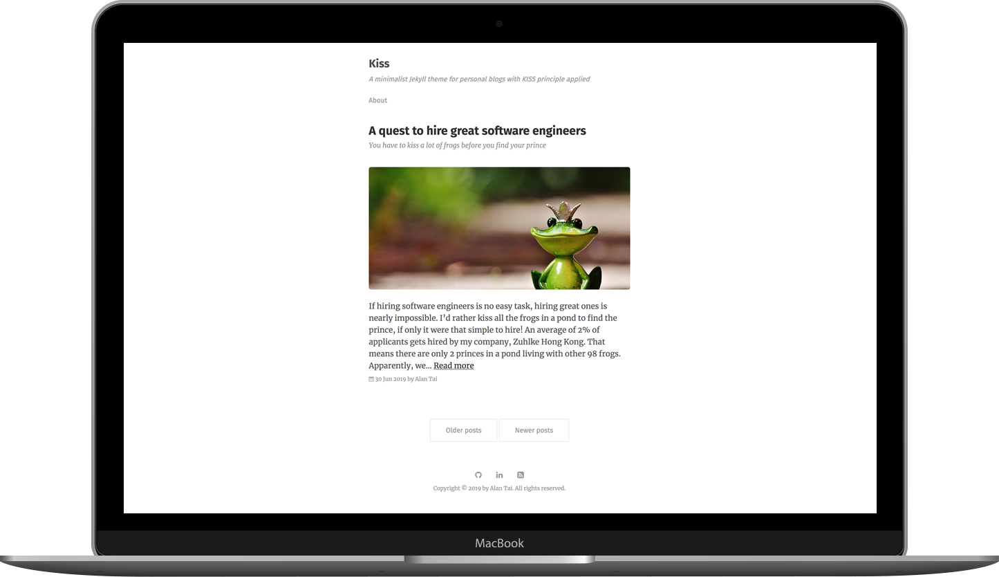

# Kiss

Kiss is a minimalist Jekyll theme for personal blogs with [KISS principle](https://en.wikipedia.org/wiki/KISS_principle) applied.

[View demo website](https://ayltai.github.io/kiss)

## Features

* Fully compatible with [GitHub Pages](https://pages.github.com/)
* Support Jekyll [gem-based](https://jekyllrb.com/docs/themes/#understanding-gem-based-themes) [remote theme](https://github.blog/2017-11-29-use-any-theme-with-github-pages/)
* Supports [Google Analytics](https://analytics.google.com/analytics/web/)
* Post comments powered by [Disqus](https://disqus.com/)
* Search engine optimization
* Supports [Font Awesome](https://fontawesome.com/)
* Code syntax highlighting

## License

[MIT license](https://github.com/ayltai/kiaa/blob/master/LICENSE)
